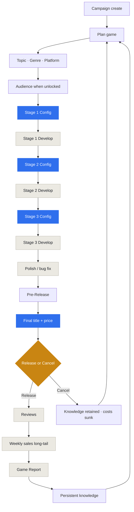

# Studio Empire — Garage Phase Game Loop

Authoritative player loop for the founder-only Garage vertical slice.

## Status (phase complete)

| Deliverable | Status |
|---|---|
| Frozen contracts (schema v3, OutcomeTrace, knowledge) | Done |
| `productionStage` vs `genreCapacityTier` naming | Done |
| Focus allocation (normalize to 100) | Done |
| Deterministic outcome trace | Done |
| Garage content slice (~12 topics, 3 platforms, 6 genres) | Done |
| Layered scoring pipeline | Done |
| Bounded expectations (no secret next-game punish) | Done |
| Game Reports + persistent knowledge | Done |
| Policy tests harness | Done (`garagePolicy.test.ts`) |
| Garage UI shell + Pre-Release + Cancel | Done |

**Success criteria proven in store integration:** three games, knowledge inheritance, no stage advance without confirm, reviews on release / sales after ≥1 week, cancel path, founder energy always 100, save/load identity for reviews & sales plan.

## Player loop (mandatory sequence)

**Rules**

- Simulation **never** picks stage sliders or advances a stage without player confirm.
- Pre-Release is required: title + launch price before Release.
- Reviews appear only on release; first sales apply on the next market week.
- OutcomeTrace freezes quality, reviews, and sales plan — load never re-rolls.
- Cancel sinks cost but still records a knowledge lesson.
- Founder has no energy meter (always available).
- Price does not change product quality — only revenue.
- Hits raise opportunity/scrutiny, not a secret quality penalty on the next title.
